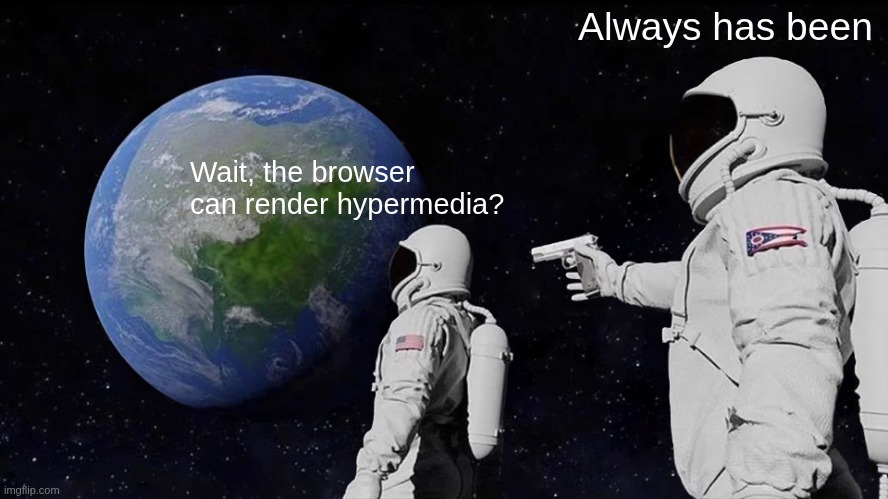
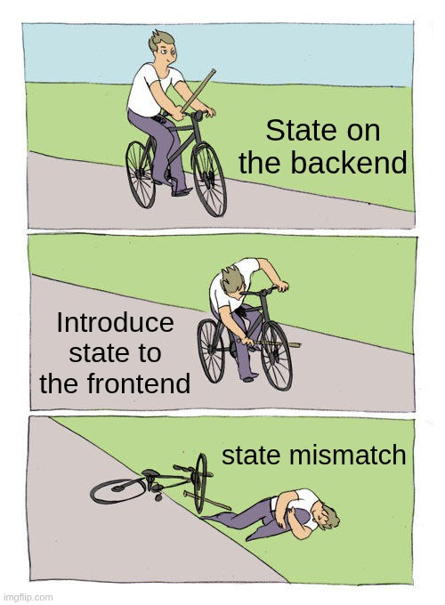

# Hypermedia Secret Meaning
Beyond ὑπέρ sequential communication μέσος

<div style="display: flex; justify-content: space-between; align-items: start; margin-bottom:0;">
  <div style="width: 66%;">
    <ul> 
        <li>Hypermedia is consumable value</li>
        <li>Web is an hypermedia content network</li>
        <li>Browser is an hypermedia render engine</li>
        <li>SEO/Crawlers/A11y tools... needs hypermedia for index and display</li>
    </ul>
  </div>
  <div style="width: 34%;">
    
    </div>
</div>


<div style="float: left; width: 20%;">
  
</div>
<div style="float: right; width: 80%;">
```html
Before web 2.0:  
<form method="POST" action="/next-step">
  <button type='submit'>I love it</button>
</form>
After web 2.0:  
<div class="ng-v-factory-builder-fakeform--_vmd0">
  <div ([:-click-:])="preventDefaultAndDoStuffToEmulateSubmit()">Please kill me</div>
</div>
```
</div>
