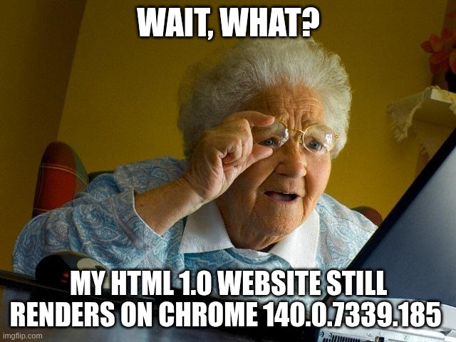

# Hypermedia Nostalgic History
Bringing serendipity since 1989

<v-click>

  

   
    <ul style="list-style-type: disc; padding-left: 20px;">
      <li>1995: HTML files over the wire via HTTP</li>
      <li>2000: Chaotic backend MPAs (PHP, .NET+ASP, Java...)</li>
      <li>2005: Golden Age: RESTful Hypermedia MPA (RoR, Spring, Symfony + JQuery)</li>
    </ul>
     
  

  

</v-click>
<v-click>
  --- web 2.0 sins begin to spread ---
</v-click>

   
<ul style="list-style-type: disc; padding-left: 20px;">
  <v-click>
    <li>2010: Chaotic frontend-state SPAs (AngularJs...)</li>
    <li>2015: Heretic Bloody Age of JSON-based SPA (React, Vue, Angular...) with state, fake routers, SSR</li>
    <li>2020: Astro, Next.js, SvelteKit, HTMX: old-school MPAs try to come back</li>
  </v-click>
  <v-click>
    <li>2025: A new star begins to shine in the northern sky 🌟: Datastar
     &nbsp;&nbsp;&nbsp;&nbsp;&nbsp;&nbsp;🚀 Hypermedia can purge the web with 2025 features, MPAs or SPAs, via AJAX, via SSE, via Signals </li>
  </v-click>
</ul>

