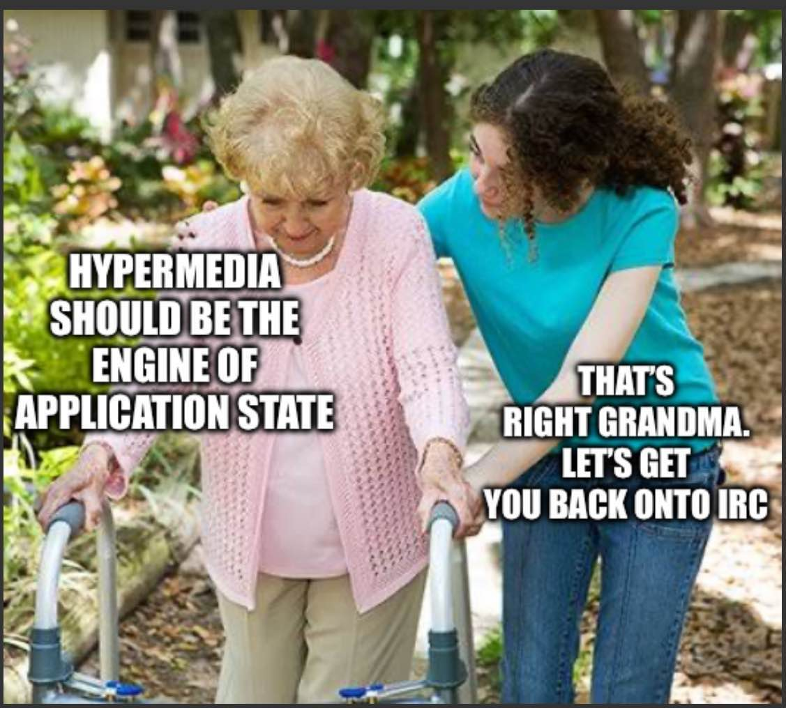
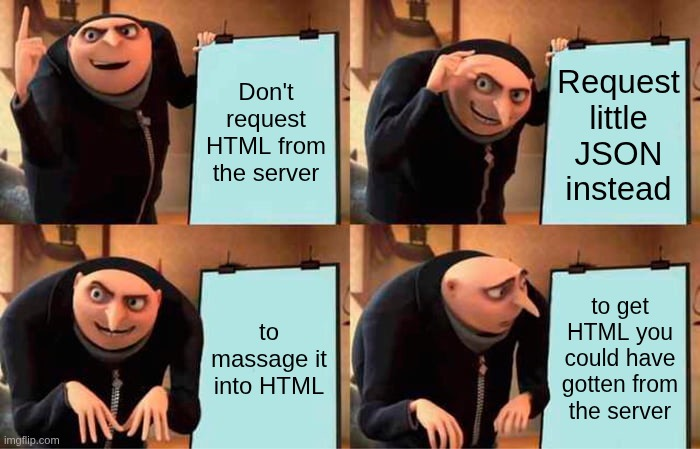
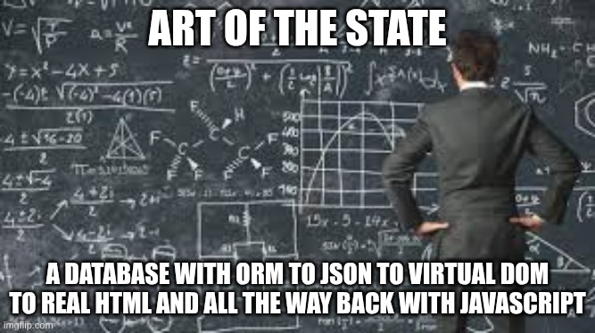
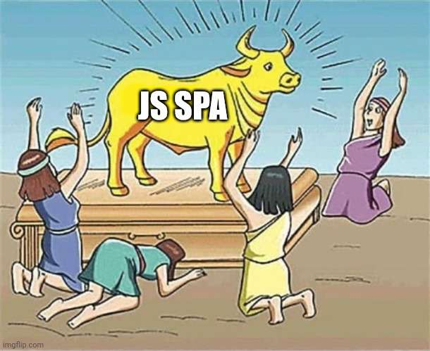
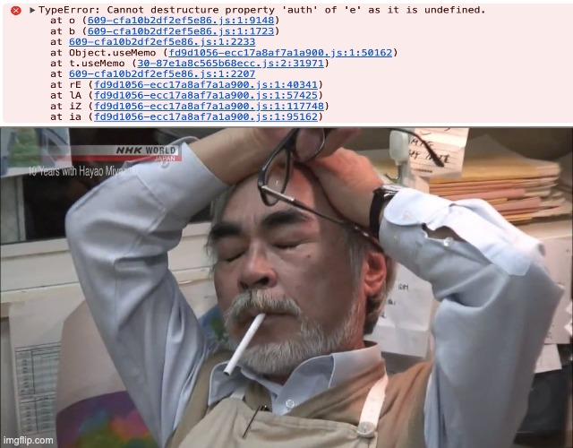
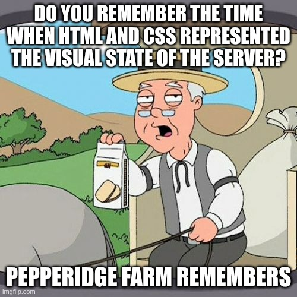

### Web sins to purge

  

    
    Disrespect olders &nbsp;&nbsp;&nbsp;➡️
  

  

    
    Bad ideas &nbsp;&nbsp;&nbsp;➡️
  

  

    
    Bad state &nbsp;&nbsp;&nbsp;➡️
  

  

    
    🔥  Heresy 🔥  &nbsp;&nbsp;&nbsp;➡️
  

  

    
    🔥🔥🔥  Hell 🔥🔥🔥  &nbsp;&nbsp;&nbsp;➡️
  

  

    
   ☠️ Nostalgic sadness ☠️
  

