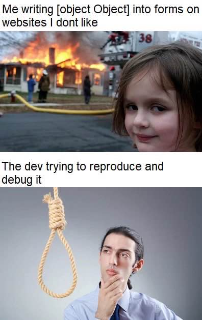
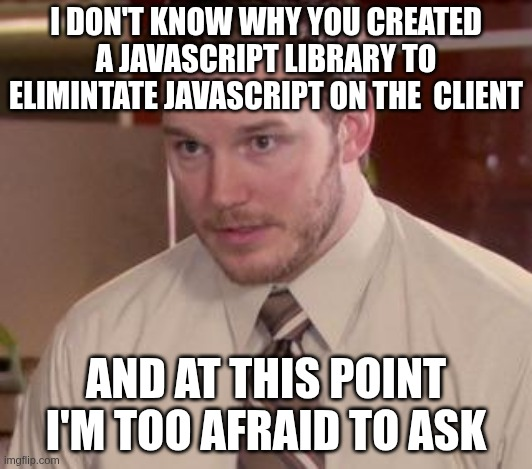

# Why HTMX was not enough
Are the wounds too deep?

  

    <h4>HTMX</h4>
    <ul>
      <li>did a great job making hypermedia/HATEOAS an important topic and building a community</li>
      <li>is lightweight, declarative, easy to understand and use</li>
      <li>pushed the state back to the backend</li>
      <li>is done</li>
    </ul>
  

  

  
  <h4>But HTMX</h4>
  <ul>
    <li>bad for real SPA use cases (calculator?) and collaborative frontend (googlesheets?)</li>
    <li>too big for what it does, rarely used alone: <strong>Hello AlpineJS</strong></li>
    <li>not HTML compliant</li>
    <li>is done</li>
  </ul>

