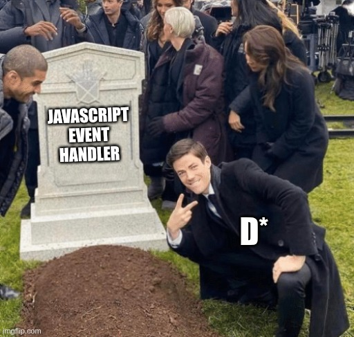
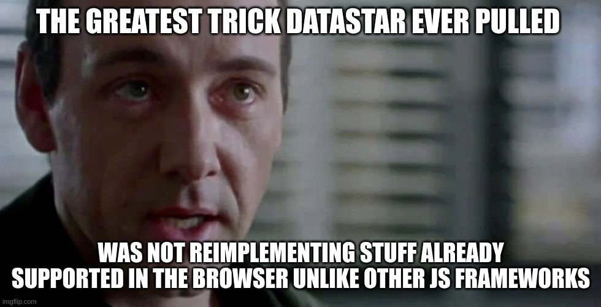

# Touch its body
It does not much, but you feel everything

  

    <ul> 
        <li>Semantic HTML for static contents</li>
        <li>Web Components for reactive components</li>
        <li>State on backend side</li>
        <li>SSE for reactive state and real-time multiplayer</li>
        <li>Command Query Responsabiltity Segregation (CQRS) for safe IO, design and perfs</li>
    </ul>
  

  

 
 

    

       
    

    

       <h3> Can you give me more than an "hello"?</h3>
       <ul>
        <li>Check out <a style="color: blue;" href="https://github.com/ltruchot/clair-obscur-datastar/tree/main/apps/todo-list" target="_blank">this todo list example for real!</a></li>
        <li>Check out <a style="color: blue;" href="https://todolist-ed8b.onrender.com/" target="_blank">this collaborative online todo list for families!</a></li>
        <li>Check out <a style="color: blue;" href="https://example.andersmurphy.com/" target="_blank">Game of life</a> by Anders Murphy</li>
       </ul>
    

