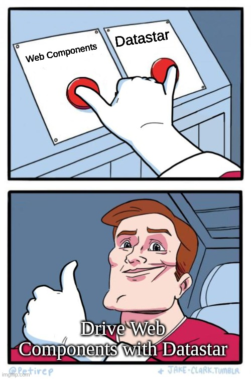
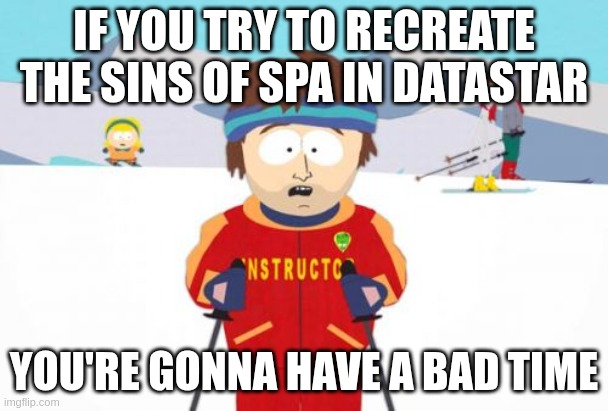

# Fall in love
Ready to make big projects together?

  

    <ul>
    <v-click>
        <li>Unlearning is hard, real Fullstack is hard</li>
        <li>Datastar will remain the tiniest part of your project</li>
    </v-click>
    <v-click>
        <li>Face new challenges with webcomponents (👀 Rocket), CSS (👀 Stellar)</li>
        <li>Hypermedia send/optimization is different (👀 Brotli)</li>
    </v-click>
    <v-click>
        <li>Dropping websockets and polling needs a new mindset (👀 CQRS/Event Sourcing)</li>
        <li>You will soon start to think about modern backends like GO</li>
    </v-click>
    </ul>
  

  <v-click>
  
  </v-click>

<v-click>

    

       
    

    

       <h3> Can you give me more than a "Todo list"?</h3>
       <ul>
        <li>Check out <a style="color: blue;" href="https://clair-obscur-datastar.onrender.com/" target="_blank">my online session room example</a></li>
        <li>Check out <a style="color: blue;" href="https://pylo.dev/play" target="_blank">Blinsky</a>, by Ben Croker</li>
       </ul>
    

</v-click>