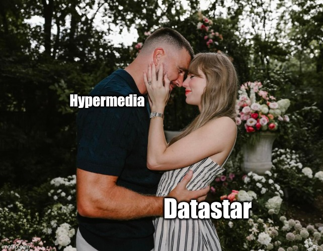
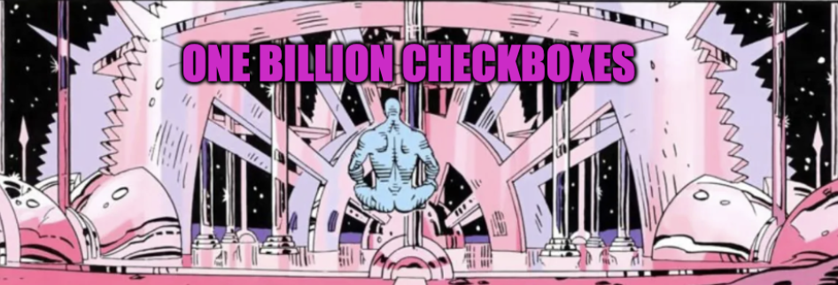

# Move in together
Warm and comfy place to build confidence

Core team: Delaney (metrics obsessed creator) - Ben (parental figure targeting tomorrow) - Johnny (quiet young genius)

<ul style="text-align: left; width: 68%;">
    <li><a style="color: blue;" href="https://data-star.dev/" target="_blank">Shiny new website</a> with all docs, examples and links</li>
    <li><a style="color: blue;" href="https://discord.gg/P6vRXCAk" target="_blank">Vivid discord server</a> with 1600+ members</li>
    <li><a style="color: blue;" href="https://github.com/starfederation/datastar/" target="_blank">3282+ stars github repo</a> easy to explore</li>
    <li><a style="color: blue;" href="https://everydaysuperpowers.dev/articles/why-i-switched-from-htmx-to-datastar/" target="_blank">Dedicated podcast</a> with 1-year history</li>
    <li><a style="color: blue;" href="https://hn.algolia.com/?q=datastar" target="_blank">Continuous Hackers News attention</a> for the worst and the best</li>
    <li><a style="color: blue;" href="https://github.com/alvarolm/datastar-resources?tab=readme-ov-file" target="_blank">A ton of resources</a> to discover</li>
    <li>First dedicated conference planned for 2026</li>
</ul>

Bonus:

