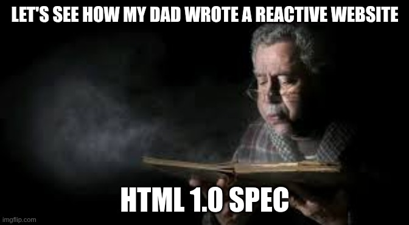

# What Datastar is not

<v-click>

  

    <h4>Being delusional is a sin as well</h4>
    <ul>
      <li>NOT a silver bullet - it's a solid toolbox for experienced web developers</li>
      <li>NOT for continuous bi-directional communication (like cursor tracking)</li>
      <li>NOT local-first friendly</li>
      <li>NOT for empty-HTML signals-based SPAs, NOR drag-and-drop static sites</li>
    </ul>
  

  

</v-click>

<v-click>

  
  

    <h4>The industry may not be ready</h4>
    <ul>
      <li>Backend vs Frontend now mostly fulfills industry requirements...</li>
      <li>...and individual identities and skills</li>
      <li>React-like SPAs could already be too big to fail</li>
      <li>Metrics are rarely important in ideology-driven debates</li>
    </ul>
  

</v-click>

<footer style="position: absolute; bottom:0; right:0;"><small><SlideCurrentNo/>/<SlidesTotal/></small></footer>
