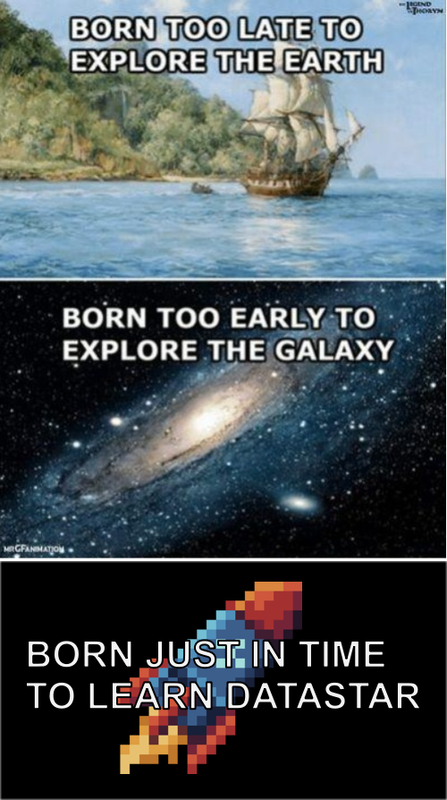
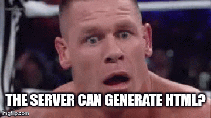

---
# try also 'default' to start simple
theme: bricks
# some information about your slides (markdown enabled)
title: Welcome to Slidev
info: |
  ## Slidev Starter Template
  Presentation slides for developers.

  Learn more at [Sli.dev](https://sli.dev)
# apply UnoCSS classes to the current slide
class: text-center
# https://sli.dev/features/drawing
drawings:
  persist: false
# slide transition: https://sli.dev/guide/animations.html#slide-transitions
transition: slide-left
# enable MDC Syntax: https://sli.dev/features/mdc
mdc: true
---

# Datastar
The hype-free fullstack hypermedia framework

  
A new star is born, a new cult can begin  

MIT License - 2025 - Loïc TRUCHOT

---
layout: intro
---

# Why DataStar ?

<ol>
<li>Hypermedia Meaning</li>  
<li>Hypermedia History</li>  
<li>Web sins to purge</li>  
<li>Why HTMX is not enough</li>  
</ol>

---
src: ./pages/001-hypermedia-meaning.md
---

---
src: ./pages/002-hypermedia-history.md
---

---
src: ./pages/003-cure-the-web.md
---

---
src: ./pages/004-why-htmx-is-not-enough.md
---

---
layout: intro
---

# Meet Datastar 🚀
Fullstack hypermedia framework

<ol>
  <li>Meet a seducing stranger</li>  
  <li>Visit its home</li>  
  <li>Touch its body</li>  
  <li>Marry it</li>
</ol>

---
src: ./pages/005-a-seducing-stranger.md
---
