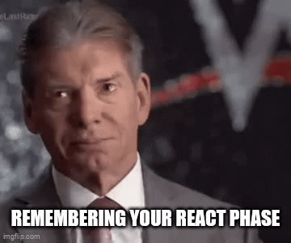

---
# try also 'default' to start simple
theme: bricks
# some information about your slides (markdown enabled)
title: Welcome to Slidev
info: |
  ## Slidev Starter Template
  Presentation slides for developers.

  Learn more at [Sli.dev](https://sli.dev)
# apply UnoCSS classes to the current slide
class: text-center
# https://sli.dev/features/drawing
drawings:
  persist: false
# slide transition: https://sli.dev/guide/animations.html#slide-transitions
transition: slide-left
# enable MDC Syntax: https://sli.dev/features/mdc
mdc: true
layout: full
---

<h1 style="text-align: center; color: white">This presentation is not about a cult</h1>
  Definitely not

---
layout: intro
class: text-center
---

# Datastar

The hype-free fullstack hypermedia framework

  
A new star is born 

MIT License - October 2025 - Loïc TRUCHOT

---
layout: intro
---

# Why Datastar?

<v-click>

  <ol>
    <li>Hypermedia Meaning</li>
    <li>Hypermedia History</li>
    <li>Web sins to purge</li>
    <li>Why HTMX is not enough</li>
  </ol>

</v-click>

<v-click>

</v-click>

---
src: ./pages/001-hypermedia-meaning.md
---

---
src: ./pages/002-hypermedia-history.md
---

---
src: ./pages/003-web-sins-to-purge.md
---

---
src: ./pages/004-why-htmx-is-not-enough.md
---

---
layout: intro
---

# Meet Datastar 🚀

Fullstack hypermedia framework
<v-click>
  

  <ol>
    <li>Meet a seductive stranger</li>
    <li>Touch its body</li>
    <li>Fall in love</li>
    <li>Move in together</li>
  </ol>
  

</v-click>
<v-click>
  
</v-click>
---
src: ./pages/005-a-seductive-stranger.md
---

---
src: ./pages/006-touch-its-body.md
---

---
src: ./pages/007-fall-in-love.md
---

---
src: ./pages/008-move-in-together.md
---

---
layout: intro
---

# Now what?
Should I jump on the no-hype train?

<v-click>

<ol>
  <li>Most hated framework ever</li>
  <li>Thank you</li>
  <li>Sources</li>
</ol>

</v-click>
<v-click>

</v-click>

---
src: ./pages/009-most-hated.md
---

---
layout: cover
---

# Thank you

<v-click>

</v-click>

---

# Sources
Thanks to the community who helped me to make this presentation better

- **A ton of meme, coming from the community channel**: <a href="https://discord.gg/Npdvb6hB" style="color: blue;" target="_blank">Discord</a>

- **Changelog Podcast**: <a href="https://open.spotify.com/episode/75i5QsR1kdYbktLxWwxbUt?si=c8769293513f4f6f" style="color: blue;" target="_blank">Spotify episode</a>

- **Hx-pod Podcast**: <a href="https://open.spotify.com/episode/4KBDl219JNmv3IepyDSetr?si=058c2056e4b545c4" style="color: blue;" target="_blank">Spotify episode</a>

- **Louis Sunshine playlist**: <a href="https://www.youtube.com/watch?v=vLekrUywdRI&list=PLrXlQsHltFEi1ceIoRh9AuHCZe5-kBpd_" style="color: blue;" target="_blank">YouTube playlist</a>

- **Chris May Blog**: <a href="https://everydaysuperpowers.dev/articles/why-i-switched-from-htmx-to-datastar/" style="color: blue;" target="_blank">HTMX to Datastar blog post</a>

Want to steal something from this presentation, or even improve it?  
--> <a href="https://github.com/ltruchot/clair-obscur-datastar/tree/main/presentations/datastar-2025-10-17" style="color: blue;" target="_blank">GitHub repository containing this slidev code</a>  

