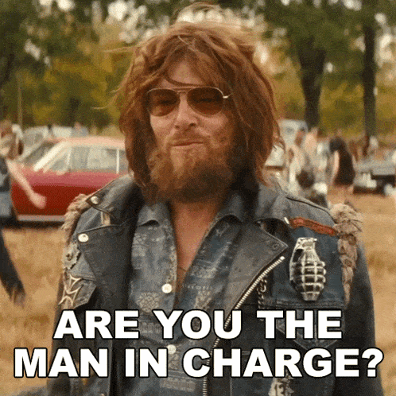

# Current organisation
Every friday 2:00 to 3:15PM

  

    Zeenea tech sessions organised by:
    <ul style="list-style-type: disc; padding-left: 20px;">
      <li style="color: salmon;">@Fabien HIEGEL</li>
      <li style="color: salmon;">@Loïc TRUCHOT</li>
      <li>All of you folks</li>
    </ul>

  -> Check out the <a href="https://actian.atlassian.net/wiki/x/1YZaRw" style="color: blue;">next sessions</a> (Feel free to add your next talk)
   
  -> Remember <a href="https://actian.atlassian.net/wiki/x/7qBaRw" style="color: blue;">past presentations</a> (Share your slides/videos)
   
  -> Your collegues need your knowledge ! <a href="https://actian.atlassian.net/wiki/x/ogCpZg" style="color: blue;">pending topics</a>
   
    Welcome to <a href="https://actian.slack.com/archives/C098F6HD6AF" style="color: purple;">#zeene-tech-session</a> and <a href="https://actian.slack.com/archives/C098JJYPBJN" style="color: purple;">#zeenea-tech-watch</a>
  

  

