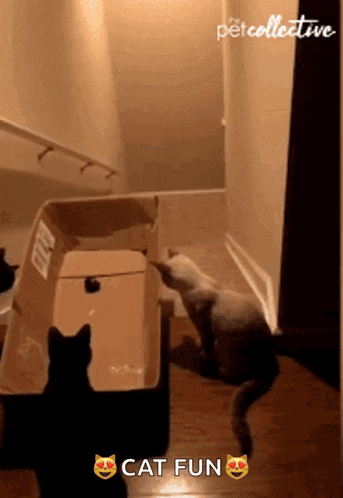

# Thank you
Thank you for your time!

  

    And now, let's have some fun with  
     
    @Sébastian and @Jérôme 
     
    <h2>Better error handling</h2>
    <h4>(get rid of Either_T !!!)</h4>
  

  

      
  

   

